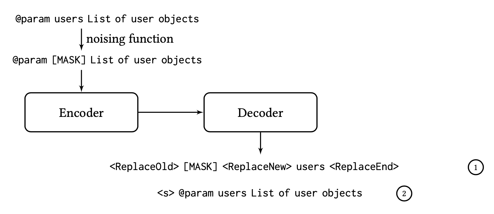

- [Code Generation](#code-generation)
  - [Datasets](#datasets)
    - [Dataset for imperative programming language generation](#dataset-for-imperative-programming-language-generation)
    - [Dataset for Text-to-SQL generation](#dataset-for-text-to-sql-generation)
  - [Techniques](#techniques)
    - [Generation architectures](#generation-architectures)
    - [Representation for code](#representation-for-code)
    - [Pretrained models](#pretrained-models)
  - [Tools](#tools)
- [Code Understanding](#code-understanding)
  - [Datasets](#datasets-1)
  - [Techniques](#techniques-1)
    - [Understanding with pre-trained models](#understanding-with-pre-trained-models)
    - [Understanding with GNNs](#understanding-with-gnns)
- [End](#end)

# Code Generation
A list of papers and resources dedicated to code generation

## Datasets
### Dataset for imperative programming language generation
- Djongo: [Learning to generate pseudo-code from source code using statistical machine translation](https://ieeexplore.ieee.org/document/7372045), 2015
- Hearthstone: [Latent Predictor Networks for Code Generation](https://arxiv.org/pdf/1603.06744.pdf), 2016
- CoNaLa: [Learning to Mine Aligned Code and Natural Language Pairs from Stack Overflow](https://arxiv.org/abs/1805.08949?context=cs), 2018
- Concode: [Mapping language to code in programmatic context](https://arxiv.org/abs/1808.09588), 2018
- APPS: [Measuring coding challenge competence with apps](https://arxiv.org/abs/2105.09938), 2021
- HumanEval: [Evaluating large language models trained on code](https://arxiv.org/abs/2107.03374), 2021
- CodeContest: [Competition-Level Code Generation with AlphaCode](https://arxiv.org/abs/2203.07814), 2022
- Lyra: [Lyra: A Benchmark for Turducken-Style Code Generation](https://arxiv.org/abs/2108.12144), 2022
  

  
<code>abstract</code>

  <small>
  This paper define a new code generation task: given a natural language comment, this task aims to generate a program in a base imperative language with an embedded declarative language. Then they present Lyra: a dataset in Python with embedded SQL. This dataset contains 2,000 carefully annotated database manip- ulation programs from real-world projects. Each program is paired with both a Chinese comment and an English comment.
  </small>
  

### Dataset for Text-to-SQL generation
- ATIS: [Evaluation of spoken language systems: The ATIS domain](https://aclanthology.org/H90-1020.pdf),1990; [Learning a neural semantic parser from user feedback](https://arxiv.org/pdf/1704.08760.pdf), 2017
- GeoQuery: [Learning to parse database queries using inductive logic programming](https://www.cs.utexas.edu/~ml/papers/chill-aaai-96.pdf), 1996; [Towards a theory of natural language interfaces to databases](https://citeseerx.ist.psu.edu/viewdoc/download?doi=10.1.1.473.6162&rep=rep1&type=pdf), 2003
- Restaurants: [Automated construction of database interfaces: Intergrating statistical and relational learning for semantic parsing](https://aclanthology.org/W00-1317.pdf), 2000
- Academic: [Constructing an interactive natural language interface for relational databases](https://dl.acm.org/doi/abs/10.14778/2735461.2735468?casa_token=_o21cAAM6tsAAAAA:-LG_Hl4pPHENO6VlZhDiTbJbH94t3_E0NutxwBnkoGfvqmqbU4pKAO1Vll7nLU2O1fOzuPprx4dZ4z0), 2004
- Yelp&IMDB: [SQLizer: query synthesis from natural language](https://dl.acm.org/doi/abs/10.1145/3133887), 2017
- Scholar: [Learning a neural semantic parser from user feedback](https://arxiv.org/pdf/1704.08760.pdf), 2017
- Advising: [Improving Text-to-SQL Evaluation Methodology](https://arxiv.org/abs/1806.09029), 2018

- WikiSQL: [Seq2SQL: Generating Structured Queries from Natural Language using Reinforcement Learning](https://arxiv.org/abs/1709.00103), 2017
- Spider: [Spider: A large-scale human-labeled dataset for complex and cross-domain semantic parsing and text-to-sql task](https://arxiv.org/abs/1809.08887), 2018
- CSpider: [A Pilot Study for Chinese SQL Semantic Parsing](https://arxiv.org/abs/1909.13293), 2019
- SQUALL: [On the Potential of Lexico-logical Alignments for Semantic Parsing to SQL Queries](https://arxiv.org/abs/2010.11246), 2020
- TableQA: [Tableqa: a large-scale chinese text-to-sql dataset for table-aware sql generation](https://arxiv.org/abs/2006.06434), 2020
- DuSQL: [DuSQL: A Large-Scale and Pragmatic Chinese Text-to-SQL Dataset](https://aclanthology.org/2020.emnlp-main.562/), 2020
- KaggleDBQA: [KaggleDBQA: Realistic Evaluation of Text-to-SQL Parsers](https://arxiv.org/abs/2106.11455), 2021
- SParC: [Sparc: Cross-domain semantic parsing in context](https://arxiv.org/abs/1906.02285), 2019
- CoSQL: [CoSQL: A conversational text-to-SQL challenge towards cross-domain natural language interfaces to databases](https://arxiv.org/abs/1909.05378), 2019
- CHASE: [Chase: A Large-Scale and Pragmatic Chinese Dataset for Cross-Database Context-Dependent Text-to-SQL](https://aclanthology.org/2021.acl-long.180/), 2021

## Techniques
### Generation architectures
- TreeGen: [TreeGen: A Tree-Based Transformer Architecture for Code Generation](https://ojs.aaai.org/index.php/AAAI/article/view/6430), 2020

### Pretrained models
- CodeBERT: [CodeBERT: A Pre-Trained Model for Programming and Natural Languages](https://arxiv.org/abs/2002.08155), 2020
- GraphCodeBERT: [GraphCodeBERT: Pre-training Code Representations with Data Flow](https://arxiv.org/abs/2009.08366), 2020
- CodeGPT: [CodeXGLUE: A Machine Learning Benchmark Dataset for Code Understanding and Generation](https://arxiv.org/abs/2102.04664), 2021
  

  
<code>abstract</code>

  <small>
  This paper introduce CodeXGLUE, a benchmark dataset and open challenge for code intelligence. It includes a collection of code intelligence tasks and a platform for model evaluation and comparison.
  CodeXGLUE stands for General Language Understanding Evaluation benchmark for CODE. It includes 14 datasets for 10 diversified code intelligence tasks covering the following scenarios:
  (1)code-code (clone detection, defect detection, cloze test, code completion, code repair, and code-to-code translation);
  (2)text-code (natural language code search, text-to-code generation);
  (3)code-text (code summarization);
  (4)text-text (documentation translation);
  </small>
   
  
  

- CodeT5: [CodeT5: Identifier-aware Unified Pre-trained Encoder-Decoder Models for Code Understanding and Generation](https://arxiv.org/abs/2109.00859v1), EMNLP2021
- PLBART: [Unified Pre-training for Program Understanding and Generation](https://arxiv.org/abs/2103.06333), NAACL2021
- CodeX: [Evaluating large language models trained on code](https://arxiv.org/abs/2107.03374), 2021
- PANGU-CODER: [PANGU-CODER: Program Synthesis with Function-Level Language Modeling](https://arxiv.org/abs/2207.11280), 2022
- CoditT5: [CoditT5: Pretraining for Source Code and Natural Language Editing](https://arxiv.org/abs/2208.05446), ASE 2022
  

  
<code>abstract</code>

  <small>
  This paper propose a novel pretraining objective which explicitly models edits and use it to build CoditT5, a large language model for software-related editing tasks that is pretrained on large amounts of source code and natural language comments. 
  </small>
   
  
   
  <small>
  They propose an edit-based output sequence representation: [Edit Plan] &lt;s> [Target Sequence], where the model is trained to generate an edit plan ( 1 ) consisting of explicit edit operations that reconstruct the input sequence, followed by a separation token (&lt;s>), and finally the target sequence ( 2 ) that matches the original input sequence.
  </small>
  

## Tools

- Gihub [Copilot](https://github.com/features/copilot): GitHub Copilot uses the OpenAI Codex to suggest code and entire functions in real-time, right from your editor.
- [Tabnine](https://www.tabnine.com): Tabnine AI models are only trained on permissive open source licensed code, so your code will always remain yours. 
- Amazon [CodeWhisperer](https://aws.amazon.com/codewhisperer/): Build applications faster with the ML-powered coding companion.
- [Captain Stack](https://github.com/hieunc229/copilot-clone): This feature is somewhat similar to Github Copilot's code suggestion. But instead of using AI, it sends your search query to Google, then retrieves StackOverflow and Github Gist answers and autocompletes them for you.

# Code Understanding

## Datasets
- BigCloneBench
  - provided by:[Towards a Big Data Curated Benchmark of Inter-project Code Clones](https://ieeexplore.ieee.org/document/6976121)
  - filtered by: [Detecting Code Clones with Graph Neural Network and Flow-Augmented Abstract Syntax Tree](https://arxiv.org/abs/2002.08653)
  

  
<code>abstract</code>

  <small>
  The dataset includes 901,028/415,416/415,416 pairs for training, validation and testing, respectively. 
  </small>
  

- POJ-104: [Convolutional Neural Networks over Tree Structures for Programming Language Processing](https://arxiv.org/pdf/1409.5718.pdf)  
  

  
<code>abstract</code>

  <small>
  POJ104 dataset is collected from an online judge platform, which consists of 104 program classes and includes 500 student-written C/C++ programs for each class. 
  </small>
  

## Techniques

### Variable representation

- IdBench: [IdBench: Evaluating Semantic Representations of Identifier Names in Source Code](https://arxiv.org/abs/1910.05177), ICSE2021
- VarCLR: [VarCLR: Variable Semantic Representation Pre-training via Contrastive Learning](https://arxiv.org/pdf/2112.02650), ICSE2022

### Code representation

- IRGen: [Unleashing the Power of Compiler Intermediate Representation to Enhance Neural Program Embeddings](https://arxiv.org/pdf/2204.09191.pdf), ICSE2022

### Code and comment
- [Associating Natural Language Comment and Source Code Entities](https://arxiv.org/abs/1912.06728), AAAI20

### Understanding with GNNs

- [Deep Just-In-Time Inconsistency Detection Between Comments and Source Cod](https://arxiv.org/abs/2010.01625), AAAI21

- Grape: [Grape: Grammar-Preserving Rule Embedding](https://xiongyingfei.github.io/papers/IJCAI22a.pdf), IJCAI2022

### Understanding with pre-trained models

- [Bridging pre-trained models and downstream tasks for source code understanding](https://arxiv.org/abs/2112.02268), ICSE2022
  
- ALERT: [Natural Attack for Pre-trained Models of Code](https://arxiv.org/abs/2201.08698), ICSE2022

- Compressor: [Compressing Pre-trained Models of Code into 3 MB](https://arxiv.org/abs/2208.07120), ASE2022
  

  
<code>abstract</code>

  <small>
  Compressor proposes a <b>genetic algorithm (GA)-based</b> strategy to guide the simplification process. 
  They use the knowledge <b>distillation technique</b> to train the small model: unlabelled data is fed into the large model and the outputs are used as labels to train the small model.
  </small>
   
  
  

# End
Welcome to recommend code generation papers!

Please let me know if you have any interesting work related to code generation task!

